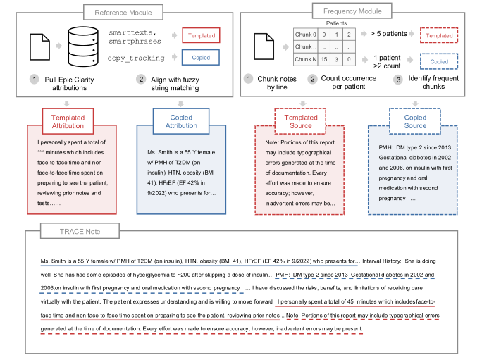
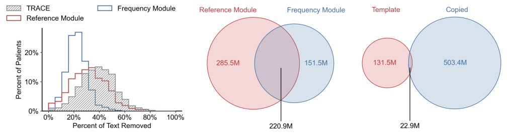

# TRACE: Template Reuse and Copied Elements

TRACE is a tool for detecting redundant text in clinical notes, targeting two distinct sources:
**templates** (boilerplate text auto-inserted during documentation) and **copied text** (content
carried over from prior notes). It comprises two components:

- **Reference Module** — uses note-level attribution metadata to systematically identify and remove text not manually written by the author.
- **Frequency Module** — de-duplicates high-frequency text blocks when attribution data are unavailable

<br>



<br>

In a random sample of 1,000 patient note histories, TRACE removes an average of **39% of text** for each patient.
Additionally, TRACE removes a total of **47% of text** across all 435,562 in the full sample.




## Quick Start

### Tool only
To install the core package:
```bash
pip install .
```

### With experiment dependencies
To also install dependencies required to reproduce the experiments (information extraction, zero-shot clinical prediction, embedding-based clinical prediction):
```bash
pip install ".[experiments]"
```

## Running TRACE

TRACE takes a JSONL file as input where each line represents a note and its metadata. If Clarity metadata is unavailable, `template_string` and `copyforward` can be left empty.
```json
{
    "note_csn_id": "<unique note ID>",
    "pat_mrn_id": "<patient ID, can map to multiple notes>",
    "upd_aut_local_dttm": "<datetime of note, YYYY-MM-DDThh:mm:ss>",
    "full_note_text": "<full text of the note>",
    "template_string": "<template data separated by metadata in brackets, e.g. '[type=smartphrase] [index=000] [template_id=00001] template text'>",
    "copyforward": [
        {
            "src_note_csn": "<unique source note ID>",
            "upd_aut_local_dttm": "<datetime of source note, YYYY-MM-DDThh:mm:ss>",
            "text": "<text of source note>"
        }
    ]
}
```

For each note, TRACE outputs identified spans in the following format:
```json
{
    "template_spans": [
        {"src": "<index of the template>", "start": "<int>", "end": "<int>", "text": "<string>"}
    ],
    "copyforward_spans": [
        {"src": "<index of the source note>", "start": "<int>", "end": "<int>", "text": "<string>"}
    ]
}
```

## Reference Module

The Reference Module uses the Ratcliff/Obershelp algorithm (Gestalt Pattern Matching) to identify templated and copied text within a note by comparing against the provided `template_string` and `copyforward` metadata.
```bash
python -m run_trace.run_trace_reference \
    --input ${FILE_PREFIX}.jsonl \
    --output ${FILE_PREFIX}_reference.jsonl
```

## Frequency Module

The Frequency Module identifies recurring text across a corpus of notes by:

1. Extracting text chunks from all notes
2. Counting how often each chunk appears across notes
3. Retaining chunks that appear across 5+ different patients (template) or 2+ times within the same patient (copied text)
4. Marking where these chunks appear in each note
```bash
python -m run_trace.run_trace_frequency \
    --input ${FILE_PREFIX}.jsonl \
    --output ${FILE_PREFIX}_frequency.jsonl
```

## Combining Modules

The Reference and Frequency Modules can be run independently or combined. To merge their outputs, use `process_spans`. This requires a metadata CSV with at minimum a `mrn` column containing unique patient IDs (corresponding to `pat_mrn_id` in the input JSONL).
```bash
python -m run_trace.process_spans \
    --meta ${META_CSV} \
    --stage1 ${FILE_PREFIX}_reference.jsonl \
    --stage2 ${FILE_PREFIX}_frequency.jsonl \
    --output ${OUTPUT_DIR}
```

This script merges spans from both modules, drops spans shorter than 50 characters, and collates note timelines per patient.

To run the Frequency Module only on text *not* already identified by the Reference Module, pass the Reference Module output as the input to the Frequency Module:
```bash
python -m run_trace.run_trace_frequency \
    --input ${FILE_PREFIX}_reference.jsonl \
    --output ${FILE_PREFIX}_frequency.jsonl
```

<details>
<summary><h2>Experiments</h2></summary>

Code for the zero-shot (information extraction and clinical outcome prediction) and embedding-based (clinical outcome prediction) experiments are in `src/zeroshot_inference` and `src/embeddings`, respectively. Due to privacy restrictions, the data cannot be shared.

### Preparing Data

To prepare data for the zeroshot experiments, generate a filtered patient timeline with TRACE-identified spans removed:
```bash
python -m zeroshot_inference.prepare_data \
    --notes <output of run_trace.process_spans> \
    --filter <datetime cutoff: YYYY-MM-DDThh:mm:ss> \
    --filter_offset <hours offset from filter> \
    --threshold <minimum span length to remove, default: 50> \
    --variables <comma-delimited list of clinical variables to store> \
    --output <output directory>
```
To prepare data for embedding experiments, use the following:
```bash
python -m embeddings.prepare_data \
    --notes <output of run_trace.process_spans> \
    --filter <column of datetime cutoff notes after: YYYY-MM-DDThh:mm:ss> \
    --filter_prior <column of datetime cutoff notes before: YYYY-MM-DDThh:mm:ss> \
    --filter_offset_start <hours start offset from filter> \
    --filter_offset_end <hours end offset from filter> \
    --threshold <minimum span length to remove, default: 50> \
    --variables <comma-delimited list of clinical variables to store> \
    --meta_identifier <identifier for patient in meta> \
    --note_identifier <identifier for patient in notes> \
    --output <output directory>
```

### Zero-shot Information Extraction
```bash
python -m zeroshot_inference.extract_information.run_inference \
    --variables <comma-delimited list of clinical variables for inference> \
    --patient_directory <output of zeroshot_inference.prepare_data> \
    --output <output CSV path>
```

### Zero-shot Outcome Prediction
```bash
python -m zeroshot_inference.clinical_prediction.run_inference \
    --variables <comma-delimited list of clinical variables for inference> \
    --patient_directory <output of zeroshot_inference.prepare_data> \
    --output <output CSV path>
```

### Embedding-based Outcome Prediction

Embed the patient notes:
```bash
python -m embeddings.generate_embeddings \
    --input <path to patient dataset> \
    --output <output prefix for embeddings> \
    --text <choices: original | removed | stage1 | stage2 | template | copyforward> \
    --variable <clinical variable to predict>
```

Then train and evaluate the classifier:
```bash
python -m embeddings.classifier \
    --input <input prefix for patient embeddings> \
    --output <output prefix for model metrics> \
    --model <optional: path to pretrained model>
```

</details>

## Citation

If you use TRACE in your research, please cite our paper:
```bibtex
@article{cahoon2026trace,
    title     = {Clinical Note Bloat Reduction for Efficient LLM Use},
    author    = {Cahoon, Jordan L. and Stanwyck, Chloe and Aali, Asad and Madding, Rachel and Sun, Emma and Jiang, Yixing and Dhanasekaran, Renumathy and Alsentzer, Emily},
    journal   = {arXiv preprint arXiv:2026.XXXXX},
    year      = {2026},
    url       = {https://arxiv.org/abs/2026.XXXXX}
}
```

\* Equal contribution
